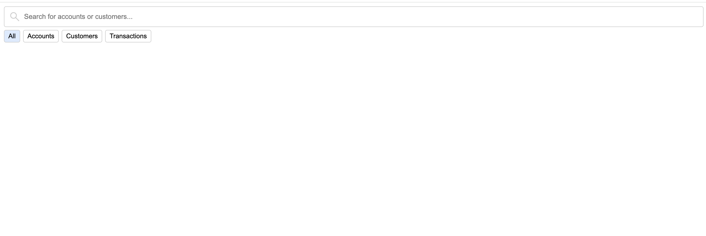
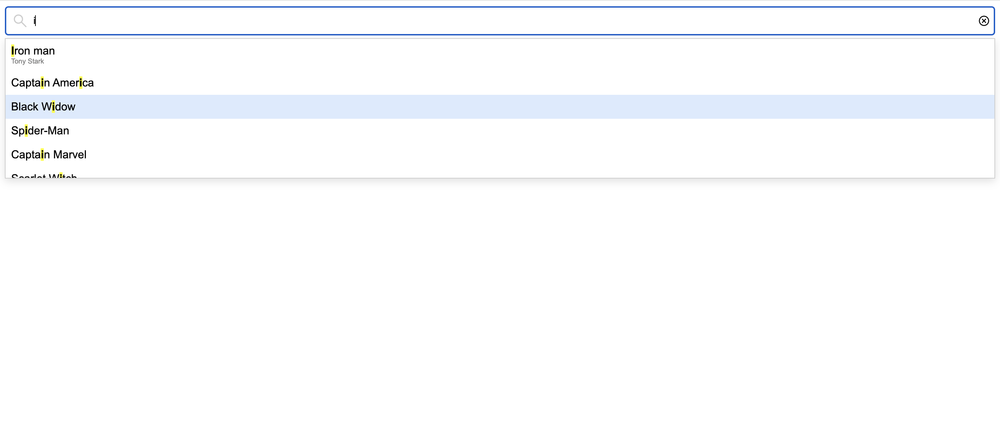
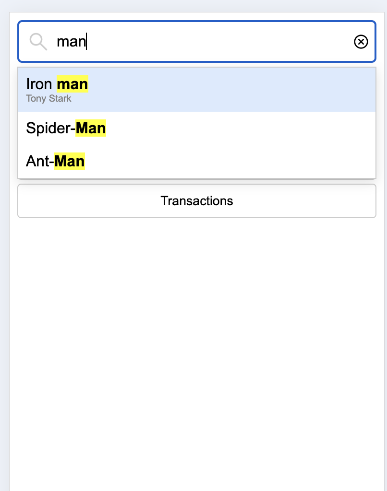
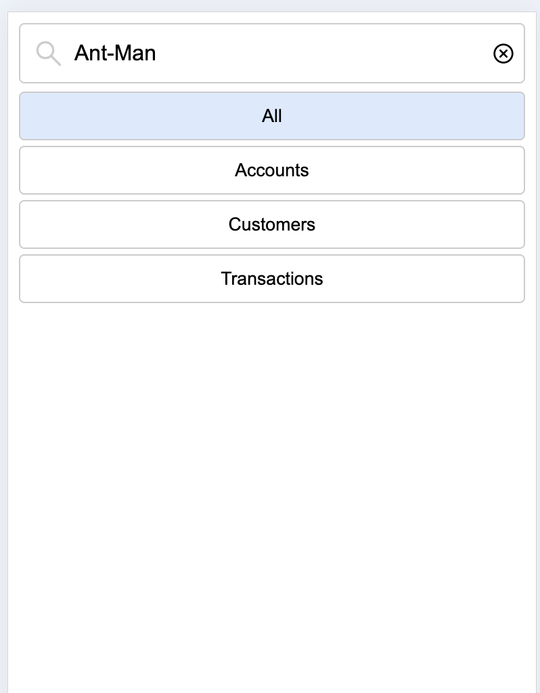

# Smart Search Web Component

A reusable Smart Search component built using Lit (Web Components).
Supports dynamic search, filtering, keyboard navigation, accessibility, and flexible theming.

---

## Features

* Interactive search with debounce
* Dynamic dropdown results
* Filter options (All, Accounts, Customers, Transactions)
* Full keyboard navigation (Arrow keys, Enter, Escape)
* Highlight matched text
* Accessibility support (ARIA roles, screen reader friendly)
* Shadow DOM for style isolation
* Event-based communication with parent apps
* Lightweight and framework-independent
* Built-in light and dark theme support
* Custom theming using CSS variables

---

## NPM Package

This component is available on NPM:

```bash
npm install smart-search-iwaymen
```

View on NPM: https://www.npmjs.com/package/smart-search-iwaymen

---

## Installation

Clone the repository:

```bash id="k5z4lp"
git clone https://github.com/sfaizal88/smart-search.git
cd smart-search
npm install
```

---

## Development

Run the development server:

```bash id="i3ptl9"
npm run dev
```

Open in browser:

```txt id="z3c2xg"
http://localhost:5173
```

---

## Build

Build the component for production:

```bash id="y8ux4o"
npm run build
```

Output:

```txt id="p5cwkt"
dist/smart-search.js
```

---

## Testing

Run tests using Vitest:

```bash id="u7o9d2"
npm test
```

### Tests cover:

* Component rendering
* User interactions (typing, click)
* Keyboard navigation
* Event communication
* Edge cases (no results, disabled state)

---

## Usage

### In HTML

```html id="l2n7ys"
<script type="module" src="./dist/smart-search.js"></script>

<smart-search placeholder="Search users..."></smart-search>
```

---

### In React

Install using npm:

```bash id="u7o9d21"
npm install smart-search-iwaymen
```

```jsx id="5c4gpn"
import { useEffect, useRef } from 'react';
import 'smart-search-iwaymen';

function App() {
  const ref = useRef(null);

  useEffect(() => {
    const el = ref.current;

    const handler = (e) => console.log(e.detail);

    el.addEventListener('search-change', handler);

    return () => el.removeEventListener('search-change', handler);
  }, []);

  return <smart-search ref={ref}></smart-search>;
}
```

---

### In Angular

Install using npm:

```bash id="u7o9d22"
npm install smart-search-iwaymen
```

```ts id="g6r2vq"
import 'smart-search-iwaymen';
```

```html id="o3wr4l"
<smart-search></smart-search>
```

---

## Properties (Props)

| Property        | Type    | Default     | Description                    |
| --------------- | ------- | ----------- | ------------------------------ |
| placeholder     | string  | "Search..." | Input placeholder text         |
| debounceTime    | number  | 500         | Delay before search triggers   |
| disabled        | boolean | false       | Disables input field           |
| value           | string  | ""          | Controlled input value         |
| enableHighlight | boolean | false       | Highlight matched text         |
| theme           | string  | "light"     | Theme mode ("light" or "dark") |

---

## Events

| Event         | Description               | Payload          |
| ------------- | ------------------------- | ---------------- |
| search-change | Fired when user types     | { query, value } |
| result-select | Fired when item selected  | SearchItem       |
| filter-change | Fired when filter changes | { filter }       |

---

## Theming

The component supports flexible theming using CSS variables.

---

### Default (Light Theme)

The component uses a default theme internally:

```css id="6j5s8q"
:host([theme="light"]) {
    --input-bg: white;
    --text-color: black;
    --border-color: #ccc;
    --dropdown-bg: white;
    --hover-bg: #f5f5f5;
    --active-bg: #dbeafe;
    --muted-text: gray;
    --error-color: red;
    --btn-bg: white;
    --highlight-bg: yellow;
}
```

---

### Dark Theme (Using Prop)

You can enable dark mode using the `theme` property:

```html id="l5a9rm"
<smart-search theme="dark"></smart-search>
```

Internally, the component applies:

```css id="k3n1xv"
:host([theme="dark"]) {
  --input-bg: #1f2937;
  --text-color: #f9fafb;
  --border-color: #374151;
  --dropdown-bg: #111827;
  --hover-bg: #374151;
  --active-bg: #2563eb;
  --muted-text: #9ca3af;
  --error-color: #f87171;
  --btn-bg: #1f2937;
  --highlight-bg: #facc15;
}
```

---

### Custom Theme Override (Recommended)

Users can override theme values directly using CSS variables:

```html id="w1v8mn"
<smart-search
  style="
    --input-bg: red;
    --text-color: white;
    --dropdown-bg: black;
  "
></smart-search>
```

---

## Data Structure

```ts id="t7m1k2"
type SearchItem = {
  id: string;
  type: 'account' | 'customer' | 'transaction';
  label: string;
  subtitle?: string;
  meta?: string;
  disabled?: boolean;
  raw?: unknown;
};
```

---

## Architecture

The component follows separation of concerns:

* Component (`smart-search.ts`)
  UI rendering, state management, event handling

* Service (`smart-search.service.ts`)
  Data fetching and filtering logic

* Utils (`smart-search.utils.ts`)
  Helper functions such as highlighting

* Styles (`smart-search.styles.ts`)
  Encapsulated component styles

---

## Project Structure

```
src/
  data/
    mockData.ts
  utils/
    types.ts 
  theme/
    light-theme.ts
    dark-theme.ts
  component/
    __test__/
      smart-search.test.ts
    smart-search.ts
    smart-search.styles.ts
    smart-search.service.ts
    smart-search.utils.ts
  index.ts
index.html
.gitignore
vite.config.ts
package.json
vite.config.ts
README.md
```

---

## Screenshots

### Desktop View

<div style="display: flex; gap: 20px; margin-bottom: 20px;">
  <div style="flex: 1;">
    
  </div>
  <div style="flex: 1;">
    
  </div>
</div>

### Mobile View

<div style="display: flex; gap: 20px; justify-content: center;">
  <div style="width: 300px;">
    
  </div>
  <div style="width: 300px;">
    
  </div>
</div>

---

## Future Improvements

* Async API integration
* Virtualized list for large data

---

## Author

Ahamed Faizal
